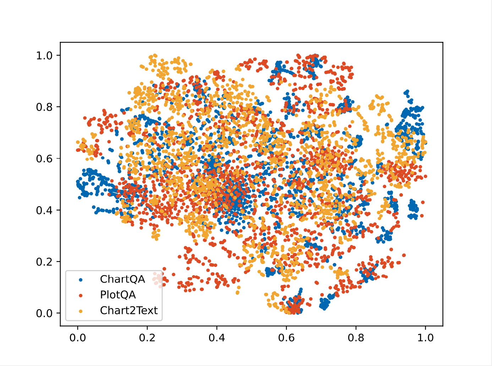
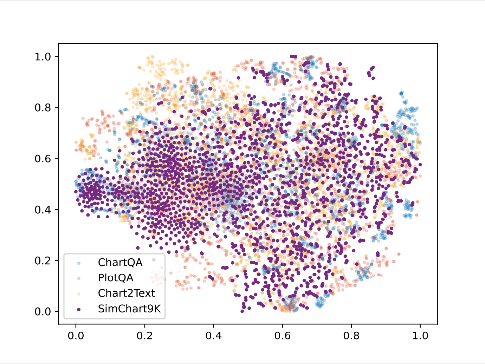
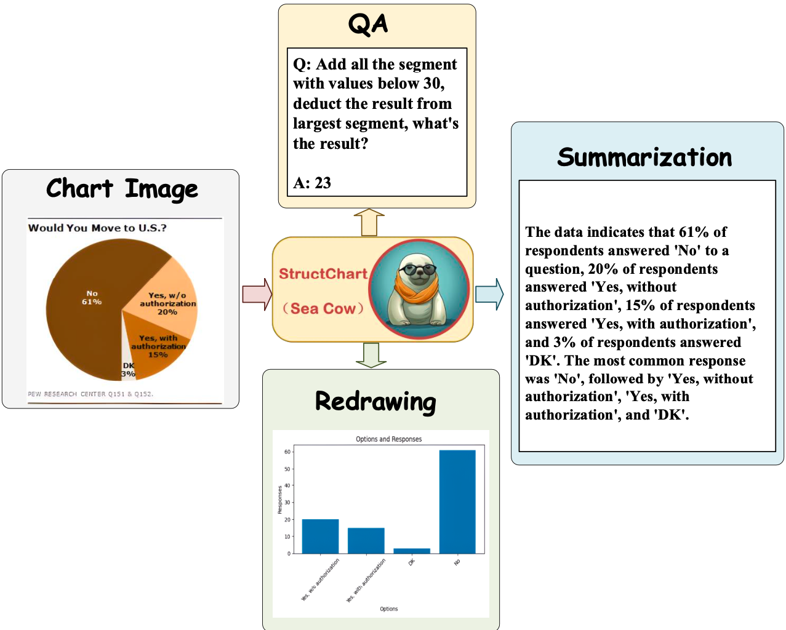
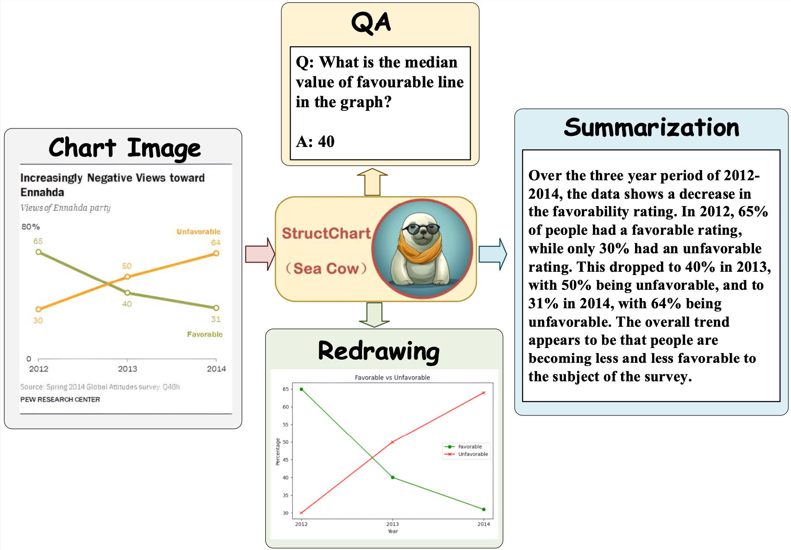

[](https://arxiv.org/abs/2309.11268)
[](https://github.com/Uni-Modal/SimChart9K/issues)
[](https://github.com/Uni-Modal/SimChart9K/pulls)

# SimChart9K

<div align=center>

</div>

<div align="center">
<h1>SimChart9K: An LLMs-based Simulatied Visual Chart Understanding Benchmark<br></h1>
</div>

We perform data augmentation for chart perception and reasoning by leveraging an LLMs-based self-inspection data production scheme, producing the SimChart9K dataset, where the simulated dataset consists of 9,536 chart images and associated data annotations in CSV format. Besides, we observe that StructChart continuously improves the chart perception performance as more simulated charts are used for pre-training.

## SimChart9K Dataset Download from google drive
Downloading the official [SimChart9K](https://drive.google.com/file/d/1M_NA3sIJNwCUfqB1HH0p4lsnEm3NbvsI/view?usp=sharing) dataset from google drive

## SimChart9K Dataset Download from Opendatalab

a. Register an account from OpenXLab website as follows.
```shell
https://openxlab.org.cn/home
```

b. Install the dependent libraries as follows:

* Install the openxlab dependent libraries.
  ```shell
    pip install openxlab
  ```
* Obtain the Access Key and Secret Key on the OpenXLab website by clicking the button of Account Security
* Login the OpenXLab using the Access Key and Secret Key
  ```shell
    openxlab login
  ```

c. Download the SimChart9K dataset by performing the following command:
```shell
openxlab dataset get --dataset-repo  Lonepic/SimChart9K
```

## t-SNE comparisons with Real Chart Datasets

<p align="center">
  
  <div>Feature Distribution using t-SNE of Real Datasets.</div>
</p>


<p align="center">
  
  <div>Feature Distribution using t-SNE of both Real Datasets and SimChart9K.</div>
</p>

## Visualization Exapmles

<p align="center">
  
  <div>Visualization results using the proposed StructChart on different chart-related reasoning tasks including Question Answering (QA), Summarization, and Redrawing.</div>
</p>

<p align="center">
  
  <div>Visualization results using the proposed StructChart on different chart-related reasoning tasks including Question Answering (QA), Summarization, and Redrawing.</div>
</p>

## Citation
Please consider citing our work if this dataset is helpful for your research:

```
@article{xia2023structchart,
  title={StructChart: Perception, Structuring, Reasoning for Visual Chart Understanding},
  author={Xia, Renqiu and Zhang, Bo and Peng, Haoyang and Ye, Hancheng and Yan, Xiangchao and Ye, Peng and Shi, Botian and Yan, Junchi and Qiao, Yu},
  journal={arXiv preprint arXiv:2309.11268},
  year={2023}
}
```
